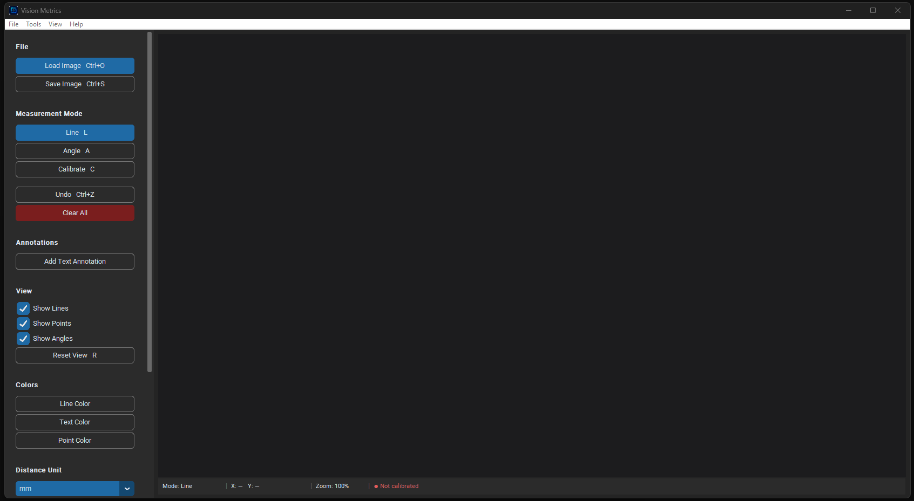

# Vision Metrics

**Vision Metrics** is a free, professional desktop tool for precise image measurement and annotation — built for metrology, quality control, and engineering image analysis.



---

## Features

- **Distance measurement** with real-time rubber-band preview and calibrated unit display
- **Angle measurement** between three points with automatic arc rendering
- **Scale calibration** — define a known distance to convert pixels into mm, cm, or inches
- **Text annotations** placed directly on the image
- **Zoom to cursor** — scroll wheel zooms into the exact area under your mouse
- **Pan** with middle mouse button
- **Undo / Clear** for all measurement types
- **Toggle visibility** of lines, points, and angles independently
- **Color customization** for lines, text, and points
- **Dark / Light mode**
- **Save annotated image** as PNG or JPEG

---

## Installation

1. Clone the repository:
   ```bash
   git clone https://github.com/ZbynekStebnicky/Vision-Metrics.git
   cd Vision-Metrics
   ```

2. Install dependencies:
   ```bash
   pip install -r requirements.txt
   ```

3. Run the app:
   ```bash
   python VisionMetrics.py
   ```

---

## Requirements

- Python 3.10+
- `opencv-python`
- `numpy`
- `Pillow`
- `customtkinter`

---

## Usage

### Basic workflow

1. **Load an image** — File → Open Image (or `Ctrl+O`)
2. **Calibrate** — press `C`, click two points of known distance, enter the real-world value
3. **Measure distances** — press `L`, click two points
4. **Measure angles** — press `A`, click three points (vertex is the second point)
5. **Annotate** — use the *Add Text Annotation* button, type your text, click to place
6. **Save** — File → Save Image (`Ctrl+S`) exports the image with all annotations baked in

### Navigation

| Action | Input |
|---|---|
| Zoom in/out | Scroll wheel (zooms to cursor) |
| Pan | Hold middle mouse button + drag |
| Reset view | `R` |

### Keyboard shortcuts

| Key | Action |
|---|---|
| `L` | Line mode |
| `A` | Angle mode |
| `C` | Calibrate mode |
| `R` | Reset view |
| `Ctrl+O` | Open image |
| `Ctrl+S` | Save image |
| `Ctrl+Z` | Undo last action |
| `Esc` | Cancel current input |

---

## Distance Units

Select your preferred unit from the sidebar dropdown: **mm**, **cm**, **in**, or **px**. The unit is applied to all live preview labels, measurement history, and saved annotations. Calibration is required for mm / cm / in output.

---

## License

MIT
